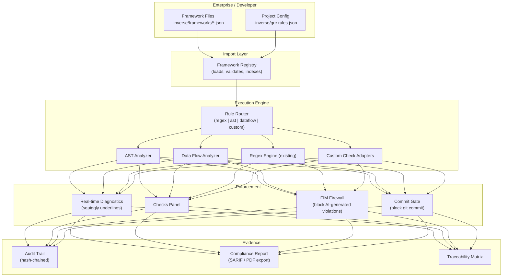

# neuralInverseChecks: Framework-Agnostic GRC Platform

## Core Principle

> **We don't define the GRC rules. The developer/enterprise does.**

Critical and regulated software varies massively — aerospace (DO-178C), medical (IEC 62304), automotive (ISO 26262), defense (MIL-STD-498), finance (SOC 2, PCI DSS), nuclear (IEC 61513), and every org has custom internal standards on top. The IDE cannot assume which standards apply.

**The IDE is a GRC execution engine.** Enterprises import their compliance frameworks in a standardized format, and the engine enforces them in real-time during development.

---

## Architecture



---

## Framework Import Format

Enterprises create framework files in `.inverse/frameworks/`. Each file defines a compliance framework with its rules, in a format the IDE can interpret and enforce.

### Schema: `.inverse/frameworks/{framework-name}.json`

```json
{
  "framework": {
    "id": "org-security-standard-v2",
    "name": "Acme Corp Security Standard v2.0",
    "version": "2.0.0",
    "description": "Internal security coding standard for all production services",
    "authority": "Acme Security Team",
    "appliesTo": ["typescript", "javascript"],
    "severity_levels": {
      "blocker": { "blocks_commit": true,  "blocks_deploy": true  },
      "critical": { "blocks_commit": true,  "blocks_deploy": true  },
      "major":    { "blocks_commit": false, "blocks_deploy": true  },
      "minor":    { "blocks_commit": false, "blocks_deploy": false },
      "info":     { "blocks_commit": false, "blocks_deploy": false }
    }
  },

  "rules": [
    {
      "id": "ACME-SEC-001",
      "title": "No eval() or equivalent dynamic code execution",
      "description": "Dynamic code execution creates injection vulnerabilities",
      "severity": "blocker",
      "category": "security",
      "check": {
        "type": "ast",
        "match": {
          "nodeType": "CallExpression",
          "callee": ["eval", "Function", "setTimeout|setInterval with string arg"]
        }
      },
      "fix": "Use JSON.parse() for data, or pre-compiled functions",
      "references": ["CWE-94", "OWASP A03:2021"],
      "tags": ["injection", "dynamic-code"]
    },
    {
      "id": "ACME-SEC-002",
      "title": "All external input must be validated",
      "severity": "critical",
      "category": "security",
      "check": {
        "type": "dataflow",
        "taint": {
          "sources": ["req.body", "req.query", "req.params", "process.env"],
          "sinks": ["db.query", "fs.readFile", "child_process.exec", "res.send"],
          "sanitizers": ["validate", "sanitize", "escape", "DOMPurify"]
        }
      },
      "references": ["CWE-20"]
    },
    {
      "id": "ACME-SEC-003",
      "title": "No hardcoded credentials",
      "severity": "blocker",
      "category": "security",
      "check": {
        "type": "regex",
        "pattern": "(password|secret|api[_-]?key|token)\\s*[:=]\\s*['\"`][^'\"`]{4,}",
        "flags": "i"
      },
      "fix": "Use environment variables or a secrets manager"
    },
    {
      "id": "ACME-ARCH-001",
      "title": "No circular dependencies",
      "severity": "major",
      "category": "architecture",
      "check": {
        "type": "import-graph",
        "detect": "cycles"
      }
    },
    {
      "id": "ACME-SAFE-001",
      "title": "All async functions must have error handling",
      "severity": "critical",
      "category": "fail-safe",
      "check": {
        "type": "ast",
        "match": {
          "nodeType": "FunctionDeclaration|ArrowFunction",
          "constraint": "isAsync && !hasTryCatch"
        }
      }
    },
    {
      "id": "ACME-CUSTOM-001",
      "title": "Custom lint via external tool",
      "severity": "major",
      "category": "compliance",
      "check": {
        "type": "external",
        "command": "npx custom-lint --file ${file} --json",
        "parseOutput": "json",
        "resultMapping": {
          "line": "$.line",
          "message": "$.message",
          "severity": "$.level"
        }
      }
    }
  ],

  "categories": {
    "security":      { "label": "Security as Code",      "icon": "shield",    "color": "#ff5252" },
    "compliance":    { "label": "Compliance as Code",     "icon": "verified",  "color": "#ffd740" },
    "architecture":  { "label": "Architecture as Code",   "icon": "layers",    "color": "#42a5f5" },
    "data-integrity":{ "label": "Data Integrity",         "icon": "database",  "color": "#ab47bc" },
    "fail-safe":     { "label": "Fail-Safe Defaults",     "icon": "error",     "color": "#ff7043" },
    "policy":        { "label": "Code as Policy",         "icon": "policy",    "color": "#66bb6a" }
  }
}
```

### Key Design Decisions

| Decision | Rationale |
|----------|-----------|
| **JSON format** | Machine-readable, versionable in git, easy to generate from compliance tools |
| **Multiple check types** | `regex` (simple), `ast` (structural), `dataflow` (taint), `import-graph` (architecture), `external` (delegate to any CLI tool) |
| **Custom severity levels** | Enterprises define their own severity scale with commit/deploy blocking behavior |
| **References field** | Links rules to CWE, CVE, OWASP, or any external standard |
| **External check type** | Escape hatch — run any CLI tool and parse its output as violations |
| **Category mapping** | Framework categories map to the IDE's subsystem views |

---

## Proposed Changes

### Phase 1: Framework Import + Registry (Build First)

The engine that loads, validates, and executes frameworks.

---

#### [NEW] [engine/frameworkSchema.ts](file:///Users/sanjaysenthilkumar/Documents/IDE/void/src/vs/workbench/contrib/neuralInverseChecks/browser/engine/frameworkSchema.ts)

TypeScript interfaces defining the framework import schema:
- `IFrameworkDefinition` — top-level framework metadata
- `IFrameworkRule` — individual rule with check definition
- `ICheckDefinition` — union type for `regex | ast | dataflow | import-graph | external`
- `IFrameworkCategory` — custom category definitions
- `ISeverityLevel` — custom severity with blocking behavior
- Schema validation function to validate imported frameworks

#### [NEW] [engine/frameworkRegistry.ts](file:///Users/sanjaysenthilkumar/Documents/IDE/void/src/vs/workbench/contrib/neuralInverseChecks/browser/engine/frameworkRegistry.ts)

Service that manages loaded frameworks:
- Scans `.inverse/frameworks/` for JSON files on workspace open
- Validates each against the schema
- Indexes rules by category for fast lookup
- Watches for file changes (add/remove/modify frameworks on the fly)
- Exposes `getActiveFrameworks()`, `getRulesForCategory()`, `getFrameworkById()`
- Fires `onDidFrameworksChange` event
- Registered as singleton `IFrameworkRegistry`

#### [MODIFY] [engine/grcTypes.ts](file:///Users/sanjaysenthilkumar/Documents/IDE/void/src/vs/workbench/contrib/neuralInverseChecks/browser/engine/grcTypes.ts)

Extend rule types:
- `IGRCRule.type` — add `'ast' | 'dataflow' | 'import-graph' | 'external'` to existing `'regex' | 'file-level'`
- `IGRCRule.check` — structured check definition (from framework schema)
- `IGRCRule.frameworkId` — which framework this rule came from
- `IGRCRule.references` — CWE/CVE/standard references
- `IGRCRule.blockingBehavior` — `{ blocksCommit: boolean, blocksDeploy: boolean }`
- `ICheckResult.frameworkId` — trace violations back to their source framework
- `ICheckResult.references` — carry references through to the UI
- `GRCDomain` — change from fixed union type to `string` (categories are defined by imported frameworks)

#### [MODIFY] [engine/grcEngineService.ts](file:///Users/sanjaysenthilkumar/Documents/IDE/void/src/vs/workbench/contrib/neuralInverseChecks/browser/engine/grcEngineService.ts)

Evolve evaluation to support multiple check types:
- Inject `IFrameworkRegistry` — pull rules from loaded frameworks
- Add rule router: `switch(rule.check.type)` → delegate to regex engine, AST analyzer, data flow analyzer, external runner
- Keep backward compat: existing `builtinRules.ts` regex rules still work as a "built-in" framework
- Add `evaluateWithFramework(model, frameworkId)` for per-framework evaluation
- Add `getBlockingViolations()` — returns only violations that block commit/deploy

#### [MODIFY] [engine/builtinRules.ts](file:///Users/sanjaysenthilkumar/Documents/IDE/void/src/vs/workbench/contrib/neuralInverseChecks/browser/engine/builtinRules.ts)

Restructure as the **default framework** — a `IFrameworkDefinition` object rather than a flat array. This becomes the framework that ships with the IDE when no custom frameworks are imported.

#### [MODIFY] [engine/grcConfigLoader.ts](file:///Users/sanjaysenthilkumar/Documents/IDE/void/src/vs/workbench/contrib/neuralInverseChecks/browser/engine/grcConfigLoader.ts)

Update merge logic to include framework-sourced rules alongside user config rules.

---

### Phase 2: Analysis Capabilities (After Registry Works)

Build the analyzers that the framework rules reference.

---

#### [NEW] [engine/astAnalyzer.ts](file:///Users/sanjaysenthilkumar/Documents/IDE/void/src/vs/workbench/contrib/neuralInverseChecks/browser/engine/astAnalyzer.ts)

Executes `type: "ast"` rules:
- Uses the TypeScript compiler API (available via `ILanguageService`)
- Walks AST nodes matching the rule's `nodeType` filter
- Evaluates constraints (`isAsync && !hasTryCatch`, etc.)
- Returns `ICheckResult[]` with precise line/column ranges

#### [NEW] [engine/dataFlowAnalyzer.ts](file:///Users/sanjaysenthilkumar/Documents/IDE/void/src/vs/workbench/contrib/neuralInverseChecks/browser/engine/dataFlowAnalyzer.ts)

Executes `type: "dataflow"` rules:
- Taint tracking: mark sources, trace through assignments/calls, flag when reaching sinks without passing through sanitizers
- Returns `ICheckResult[]` with trace info (source → transforms → sink)

#### [NEW] [engine/importGraphAnalyzer.ts](file:///Users/sanjaysenthilkumar/Documents/IDE/void/src/vs/workbench/contrib/neuralInverseChecks/browser/engine/importGraphAnalyzer.ts)

Executes `type: "import-graph"` rules:
- Builds import graph from workspace files
- Detects cycles, layer violations, boundary violations
- Caches graph and updates incrementally on file changes

#### [NEW] [engine/externalCheckRunner.ts](file:///Users/sanjaysenthilkumar/Documents/IDE/void/src/vs/workbench/contrib/neuralInverseChecks/browser/engine/externalCheckRunner.ts)

Executes `type: "external"` rules:
- Spawns the command defined in the rule (e.g., `npx custom-lint --file ${file}`)
- Parses output using the rule's `resultMapping`
- Converts to `ICheckResult[]`
- Sandboxed with timeout to prevent hanging

---

### Phase 3: Subsystem View Evolution

Each subsystem control evolves to show framework-sourced data.

---

#### [MODIFY] All subsystem controls

`securityAsCodeControl.ts`, `complianceAsCodeControl.ts`, `architectureAsCodeControl.ts`, `dataIntegrityControl.ts`, `failSafeDefaultsControl.ts`, `codeAsPolicyControl.ts`:

- Instead of filtering by hardcoded domain string, query the `IFrameworkRegistry` for active categories
- Show which frameworks contributed each violation
- Show framework compliance percentage
- Show references (CWE, OWASP, etc.) alongside violations

#### [MODIFY] [auditAndEvidence/auditAndEvidenceControl.ts](file:///Users/sanjaysenthilkumar/Documents/IDE/void/src/vs/workbench/contrib/neuralInverseChecks/browser/auditAndEvidence/auditAndEvidenceControl.ts)

Add:
- Per-framework compliance report export
- SARIF output format for CI/CD integration
- Framework-level audit trail (when was framework imported, which version)

#### [MODIFY] [checksManagerPart.ts](file:///Users/sanjaysenthilkumar/Documents/IDE/void/src/vs/workbench/contrib/neuralInverseChecks/browser/checksManagerPart.ts)

Manager dashboard evolves:
- Show loaded frameworks with version/status
- Framework import wizard (drag-and-drop or file picker)
- Per-framework violation summary
- Global compliance score across all active frameworks

---

## Execution Order

| Step | What | Files |
|------|-------|-------|
| 1 | Define framework schema | `frameworkSchema.ts` [NEW] |
| 2 | Extend `grcTypes.ts` | `grcTypes.ts` [MODIFY] |
| 3 | Build framework registry | `frameworkRegistry.ts` [NEW] |
| 4 | Restructure built-in rules as default framework | `builtinRules.ts` [MODIFY] |
| 5 | Update config loader merge logic | `grcConfigLoader.ts` [MODIFY] |
| 6 | Evolve engine with rule router | `grcEngineService.ts` [MODIFY] |
| 7 | Build AST analyzer | `astAnalyzer.ts` [NEW] |
| 8 | Build external check runner | `externalCheckRunner.ts` [NEW] |
| 9 | Build data flow analyzer | `dataFlowAnalyzer.ts` [NEW] |
| 10 | Build import graph analyzer | `importGraphAnalyzer.ts` [NEW] |
| 11 | Evolve subsystem controls | All 6 controls [MODIFY] |
| 12 | Evolve audit + Checks Manager | `auditTrailService.ts`, `checksManagerPart.ts` [MODIFY] |

---

## Verification Plan

### Manual Verification
1. Create a sample framework file in `.inverse/frameworks/test-framework.json`
2. Verify the IDE loads it and shows its rules in the Checks Manager
3. Write code that violates framework rules, verify inline squiggles appear
4. Remove the framework file, verify violations disappear
5. Test with multiple frameworks loaded simultaneously

### Smoke Tests
- Existing regex rules (built-in framework) still fire correctly
- Framework with invalid schema shows an error in the Checks Manager
- External check type runs the specified command and parses output
